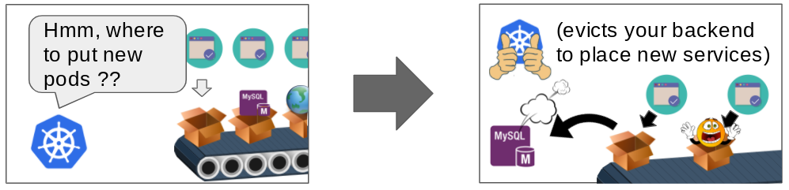

# Poodle - AI Planning in Python

 [](https://opensource.org/licenses/BSD-3-Clause) [](https://badge.fury.io/py/poodle) [](https://travis-ci.org/criticalhop/poodle)

Poodle is the Python-to-PDDL compiler and automated programming framework in early stage of development.

# Rationale

[PDDL](https://en.wikipedia.org/wiki/Planning_Domain_Definition_Language) is a widely-used language to describe [AI planning](https://en.wikipedia.org/wiki/Automated_planning_and_scheduling) [domains](http://www.cs.toronto.edu/~sheila/2542/w09/A1/introtopddl2.pdf). The applications include various [robotic planning problems](https://kcl-planning.github.io/ROSPlan/), scheduling, [logistics](https://github.com/pellierd/pddl4j/wiki/Logistics:-a-simple-running-example) and [manufacturing](https://ocharles.org.uk/posts/2018-12-25-fast-downward.html) optimization, writing intelligent agents in [computer games](https://www.researchgate.net/publication/228724581_Real-Time_Planning_for_Video-Games_A_Purpose_for_PDDL), real-time decision making, and even automated unix administration [[1]](https://www.youtube.com/watch?v=2veFbpiQv4k) [[2]](http://www.aiai.ed.ac.uk/project/oplan/oplan/applications.html). AI planning, and specifically model-based planning can be explained as a problem-solving method where the software developer describes (models) a problem rather than codes the algorithm to solve the problem - which is radically different from how the conventional software development is done today.

# Quickstart

```shell
$ pip install poodle # needs Python 3.7+
```

Let's say you have:

```python
from poodle import Object, xschedule

class World(Object): 
    prepared: int
    said: bool 

def hello(world: World):
    assert world.said == False
    world.prepared += 1

def world(world: World):
    assert world.prepared > 0
    world.said = True
    return "Hello, world!"

w = World()
w.prepared = 0
w.said = False
```

Now you have two options:

1. (obvious) execute natively, if you know the algorithm

```python
hello(w)
print(world(w)) 
# -> "Hello, World!"
```

2. if you don't know the parameters and/or sequence of execution - ask AI to figure out

```python
print(xschedule(methods=[world, hello], space=[w], goal=lambda:w.said==True))
# -> "Hello, World!"
```

# Overview

## Introduction

Poodle is a python module that enables construction of complex planning and constraint satisfaction problems using familiar pythonic paradigms in production environments. It is still in the early stage of development, but is already powering [*kubectl&#x2011;val*, our tool to prevent Kubernetes configuration errors](https://github.com/criticalhop/kubectl-val).

Poodle introduces a pair of python functions called `xschedule` and `schedule` that implement automated planning mechanism, and a new base object `Object`:

```python
xschedule(
    methods=[...],   # methods
    space=[...],     # objects
    goal=lambda: ... # condition for final object state
)
```

where `methods` is the list of methods that the planner should use to try to reach the goal state; `space` contains the list of `Object` objects that the planner will try to use as parameters for the methods, and `goal` is a simple end state condition expresed as Python logical expression, usually a `lambda` function.

`Object` is a special object type that knows how to translate itself to PDDL.

To understand how to construct a problem let's start with a classic "Hello, World" function:

```python
from poodle import Object, xschedule

class World(Object): # a class that defines object that will hold final state
    said: bool       # declaration of a bollean variable (Python 3 type hints)

def hello(world: World): # annotated function that mutates the state of `world`
    assert world.said == False # hint for the planner when this call is valid
    print("Hello, World!")
    world.said = True    # mutate the state of the parameter object

w = World()          # create first object instance
w.said = False       # define the value for `said` attribute

# now execute this in an unfamiliar way ... 
xschedule(methods=[hello], space=[w], goal=lambda:w.said==True)
```

This program will immediately print "Hello, World!" to the console, which looks obvious at first. What actually happened is that Poodle compiled your Python method into PDDL domain + problem and used AI planner to find that the final state is achievable by simply executing the only method, and all `assert`s are satisfied with our hero object `w`.

It is important to note that the more precise you describe your task the easier it is for the AI planner to figure out the algorithm. That is why Poodle enforces fully statically typed interface for all objects and methods in search space as a minimum selectivity requirement. This also saves from a lot of bugs in bigger projects.

Let's now jump to a more sophisticated example:

## Monkey and Banana problem

<p align="center">  </p>

We need to plan monkey actions to get the hanging banana: move the box, climb the box and grasp the bananas. We also need to take into account some basic laws of nature: like if the banana in on the tree, it's location is where the tree is.

```python
from poodle import Object, schedule
from typing import Set

class Position(Object):
    def __str__(self):
        if not hasattr(self, "locname"): return "unknown"
        return self.locname
class HasHeight(Object):
    height: int
class HasPosition(Object):
    at: Position
class Monkey(HasHeight, HasPosition): pass
class PalmTree(HasHeight, HasPosition): 
    def __init__(self, *args, **kwargs):
        super().__init__(*args, **kwargs)
        self.height = 2
class Box(HasHeight, HasPosition): pass
class Banana(HasHeight, HasPosition): 
    owner: Monkey
    attached: PalmTree 
class World(Object):
    locations: Set[Position]


p1 = Position()
p1.locname = "Position A"
p2 = Position()
p2.locname = "Position B"
p3 = Position()
p3.locname = "Position C"

w = World()
w.locations.add(p1)
w.locations.add(p2)
w.locations.add(p3)

m = Monkey()
m.height = 0 # ground
m.at = p1

box = Box()
box.height = 2
box.at = p2

p = PalmTree()
p.at = p3

b = Banana()
b.attached = p

def go(monkey: Monkey, where: Position):
    assert where in w.locations
    assert monkey.height < 1, "Monkey can only move while on the ground"
    monkey.at = where
    return f"Monkey moved to {where}"

def push(monkey: Monkey, box: Box, where: Position):
    assert monkey.at == box.at
    assert where in w.locations
    assert monkey.height < 1, "Monkey can only move the box while on the ground"
    monkey.at = where
    box.at = where
    return f"Monkey moved box to {where}"

def climb_up(monkey: Monkey, box: Box):
    assert monkey.at == box.at
    monkey.height += box.height
    return "Monkey climbs the box"

def grasp(monkey: Monkey, banana: Banana):
    assert monkey.height == banana.height
    assert monkey.at == banana.at
    banana.owner = monkey
    return "Monkey takes the banana"

def infer_owner_at(palmtree: PalmTree, banana: Banana):
    assert banana.attached == palmtree
    banana.at = palmtree.at
    return "Remembered that if banana is on palm tree, its location is where palm tree is"

def infer_banana_height(palmtree: PalmTree, banana: Banana):
    assert banana.attached == palmtree
    banana.height = palmtree.height
    return "Remembered that if banana is on the tree, its height equals tree's height"

print('\n'.join(x() for x in schedule(
          [go, push, climb_up, grasp, infer_banana_height, infer_owner_at],
          [w,p1,p2,p3,m,box,p,b],
          goal=lambda: b.owner == m)))
```

this program solves the slightly modified ["Monkey and banana" planning problem](http://www.inf.ed.ac.uk/teaching/courses/ai2/module4/stripsEG.pdf) and produces the result:

```
$ pip install poodle
$ python ./monkey.py
Monkey moved to Position B
Remembered that if banana is on the tree, its height equals tree's height
Remembered that if banana is on palm tree, its location is where palm tree is
Monkey moved box to Position C
Monkey climbs the box
Monkey takes the banana
```

## Kubernetes Configuration Problem

<p align="center">  </p>

In this example we are checking what are the consequences of configuration changes in Kubernetes cluster. For example, Kubernetes current state may be that once you load a new DaemonSet, important services will get evicted from the cluster in order to place your new microservice.

For a complete program feel free to check out [`kubectl-val` source code](https://github.com/criticalhop/kubectl-val).

# Principles and Architecture

Poodle compiles Python into PDDL and uses [fast-downward](http://www.fast-downward.org/) to run the search. As a typical real-world problem requires huge amounts of RAM, the whole solver bundle is running as an HTTP service in current architecture.

## Composability

Support for nested `xschedule` is on the roadmap for planning code composability, although Python already provides excellent composability mechanisms.

## Readability and Debuggability

Bad readability and debuggability have always plagued logic languages and Poodle is not an exception: it is hard to tell what the result would be just by reading the code, as multiple methods can be executed concurrently and in any order. To address this problem adding a visual debugger based on [VOWL](http://vowl.visualdataweb.org/webvowl.html) is planned. Although a combination of good code design and classical Python REPL plus some CLIPS inferencer tricks allowed us to rapidly develop quite sophisticated AI planning-based software.

# Documentation

There is no documentation at this point but we promise to provide it as `poodle` evolves. If you would like to experiment with Poodle, the general recommendation is to start from reading the examples, unit tests and the `kubectl-val` project source.

# Installation

```shell
pip install poodle
```

Poodle requires Python 3.7+ and will drop support for Python 3.7 as soon as 3.8 is stable due to heavy use of type hinting features.

# Running local solver

By default, Poodle will check if local port `16009` is open and use a solver running on localhost. If it can not find a local solver it will use a hosted solver environment from [CriticalHop](https://criticalhop.com), which has some limitations in its free-to-use version. 

To run a local solver, you must first install [fast-downward](http://www.fast-downward.org/). After you have fast-downward running - run `poodleserver` (included with `poodle`) from the fast-downward folder:

```shell
cd fast-downward
poodleserver
```

You can also specify the solver URL by environment variable `POODLE_SOLVER_URL`, e.g.:

```shell
export POODLE_SOLVER_URL=http://localhost:8082
```

## Problem sharing

If you would like to support development of AI planners, we kindly ask you to opt-in for sharing of anonymized PDDL problem data sets. This will help us to continuously improve result waiting times for everyone in the community. To enable this, please set `POODLE_STATS=1` environment variable when launching `poodleserver`. Your privacy is our highest priority, therefore we only collect generated anonymized PDDL data-sets.

# Contacts

Poodle is maintained by [CriticalHop](https://criticalhop.com), a team of dedicated AI planning engineers. If you have any questions, feel free to open a [github issue](https://github.com/criticalhop/poodle/issues) and chat with @grandrew and the team at `##poodle` on [freenode](https://freenode.net/).

Poodle is a very large project and will not be possible without community support. Translating full Python into planning domain and writing a fast solver that understands itself is absolutely wild idea that one day may become an important step towards the the Artificial General Intelligence. So we are committed to Open Source and welcome any help.

If you are interested in joining the project, please write us at info@criticalhop.com or reach out directly to me at andrew@criticalhop.com or [@Andrew_Gree](https://twitter.com/Andrew_Gree) on twitter.

We do have plans on creating commercial hosted service to support the project but as of today the main focus of CriticalHop team is delivering [kubectl-val](https://github.com/criticalhop/kubectl-val), the AI-powered kubernetes configuration validation software. 

-- 
Andrew Gree and the team
