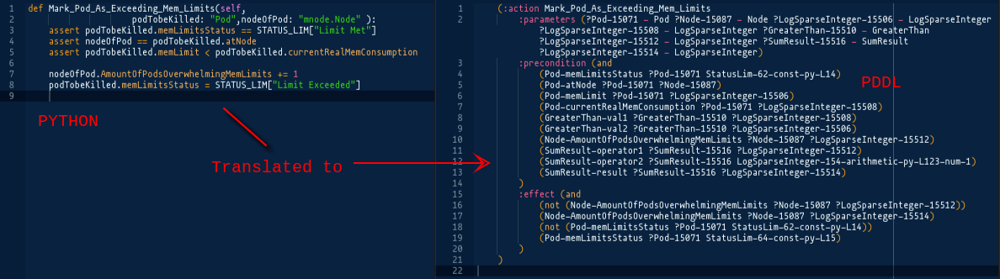

# Poodle - AI Planning in Python

[](https://opensource.org/licenses/BSD-3-Clause) [](https://badge.fury.io/py/poodle) [](https://travis-ci.org/criticalhop/poodle)

Poodle is the Python - to - AI Planning compiler and automated programming framework.

# Overview

## The Dream

*Imagine if you could tell the computer how the result should look like, <br/>
and computer automatically figures out the algorithm for you.*

*Imagine that if the algorithm is obvious you could still write it in imperative way <br/>
and computer understands it and makes use of it to reach the result faster.*

*Imagine if you have the algorithm defined by data<br/> 
and you and your computer can both use it efficiently in problem solving.*

## The Idea

<p align="center">  </p>

Recently I have discovered that Python code can be translated into AI planning task in a consistent and composable way, and that the planner can then figure out the solution from imperatively-incomplete program using accelerated state space exploration, with the result as usable as an ordinary Python program.

I believe that the future of programming is in the fusion of human and AI. In the future, developer's job will only be to optimize the program so that it fits into computer's capacity, by adding heuristics as needed. Everything else will be done by the computer itself: figuring out glue code for APIs and SDKs, adding error handling, creating abstraction plumbing from user intent to implemetation specifics, also deloyment, operation, etc.

## Introduction

Poodle is a python module that enables construction of complex planning and constraint satisfaction problems using familiar pythonic paradigms in production environments. It is still in early stage of development but is already powering [<nobr>`kubectl-val`</nobr>, our tool to prevent Kubernetes configuration errors](https://github.com/criticalhop/kubectl-val).

Poodle introduces a new python method called `xschedule` and a new base object `Object`:

```python
xschedule(
    methods=[...], # methods
    space=[...], # objects
    goal=lambda: ... # condition for final object state
)
```

where `methods` is the list of methods that the planner should use to try to reach the goal state; `space` contains the list of `Object` objects that the planner will try to use as parameters for the methods, and `goal` is a simple end state condition expresed as Python logical expression, usually a `lambda` function.

`Object` is a special object type that knows how to translate itself to PDDL.

To understand how to construct a problem let's start with a simple method `hello` that classically prints "Hello, World!":

```python
from poodle import Object, xschedule

class World(Object): # a class that defines object that will hold final state
    said: bool       # declaration of a bollean variable (Python 3 type hints)

def hello(world: World): # annotated function that mutates the state of `world`
    assert world.said == False # hint for the planner when this call is valid
    print("Hello, World!")
    world.said = True    # mutate the state of the parameter object

w = World()          # create first object instance
w.said = False       # define the value for `said` attribute

# now execute this in an unfamiliar way ... 
xschedule(methods=[hello], space=[w], goal=lambda:w.said==True)
```

This program will immediately print "Hello, World!" to the console, which looks obvious at first. What actually happened is that Poodle compiled your Python method into PDDL domain + problem and used AI planner to find that the final state is achievable by simply executing the only method, and all `assert`s are satisfied with our hero object `w`.

It is important to note that the more precise you describe your task the easier it is for the AI planner to figure out the algorithm. That is why Poodle enforces fully statically typed interface for all objects and methods in search space as a minimum selectivity requirement. This also saves from a lot of bugs in bigger projects.

Let's now jump to a more sophisticated example:

TODO

For a complete program feel free to check out [`kubectl-val` source code](https://github.com/criticalhop/kubectl-val).

# Principles and Architecture

## Python->PDDL Translator

## Composability

## Readability

## Debuggability

# Installation

```shell
pip install poodle
```

Poodle requires Python 3.7+ and will drop support for Python 3.7 as soon as 3.8 is stable.

## Running local solver

By default Poodle will check if local port `16009` is open and use solver running on localhost. If it can not find local solver it will use a hosted solver environment from [CriticalHop](https://criticalhop.com), which has some limitations in its free-to-use version. 

To run a local solver you must first install [fast-downward](http://www.fast-downward.org/). After you have fast-downward running - run `poodleserver` from fast-downard folder:

```shell
cd fast-downward
poodleserver
```

`poodleserver` comes with poodle installation and will serve requests on port `16009` on localhost.

You can also specify the solver URL by environment variable `POODLE_SOLVER_URL`, e.g.:

```shell
export POODLE_SOLVER_URL=http://localhost:8082
```

## Problem sharing

If you would like to support development of AI planners we kindly ask you to opt-in for problem sharing. This can be done by setting `POODLE_STATS=1` environment variable when launching `poodleserver`. We took special care not to send any private informaion and we only collect generated anonymized PDDL files.

# Contacts

Poodle is developed by [CriticalHop](https://criticalhop.com), a team of developers, IT infrastructure gurus and classical-AI experts. If you have any questions, feel free to open a [github issue](https://github.com/criticalhop/poodle/issues) and chat with the team at `##poodle` on [freenode](https://freenode.net/).

If you are interested in joining the project or wish to use enterprise edition please write at info@criticalhop.com or reach out directly to me at andrew@criticalhop.com or [@Andrew_Gree](https://twitter.com/Andrew_Gree) on twitter.

-- 
Andrew Gree and the team